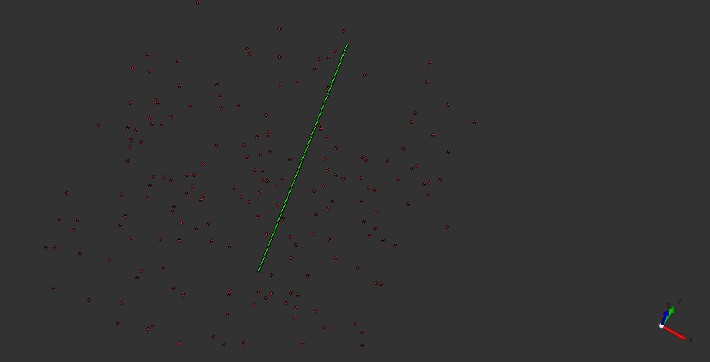

Osvcad
======

Warning : work in progress. Very very early stage of development

**Osvcad** is a CAD system that models systems using Acyclic Directed Graphs of heterogeneous geometrical entities.

The geometrical entities representing parts and assemblies can come from:

- Python scripts

- STEP files

- JSON part library files

The edges of the graph handle the positioning of the entities using and *anchor* system.