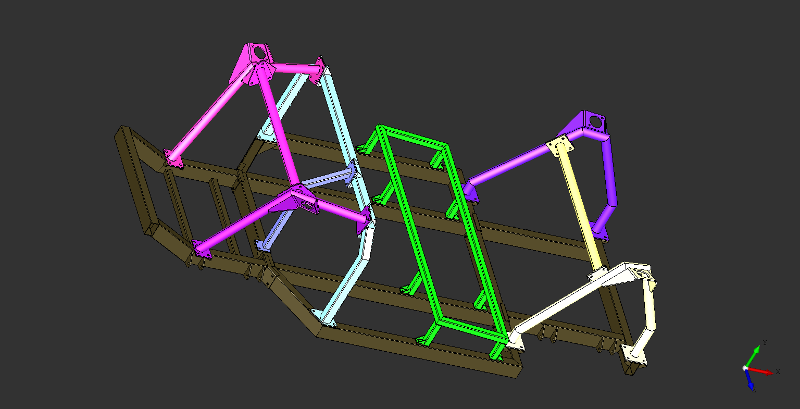
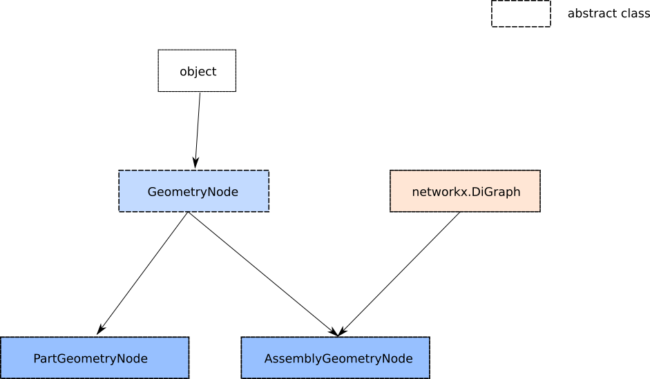
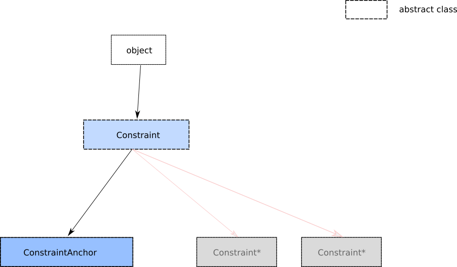
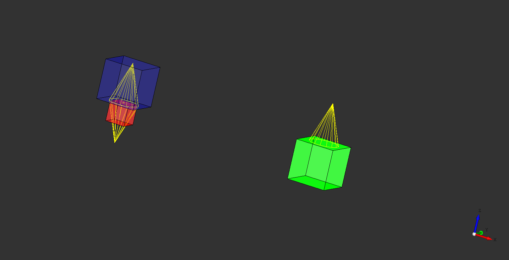

Osvcad
******

Warning : work in progress. Early stage of development

**Osvcad** is a CAD system that models systems using Acyclic Directed Graphs of heterogeneous geometrical entities.

Installing
==========

.. code-block:: shell
   :caption: Installing from the git repo:
   :name: installation

   git clone https://github.com/osv-team/osvcad
   cd osvcad
   python setup.py install

Geometry : Parts and Assemblies
===============================

The geometry of a product in **Osvcad** is handled by 2 classes: *PartGeometryNode* and *AssemblyGeometryNode* (see `nodes.py <https://github.com/osv-team/osvcad/blob/master/osvcad/nodes.py>`_).

Both *PartGeometryNode* and *AssemblyGeometryNode* inherit from *GeometryNode* which is an abstract class used to define a common interface. In addition, *AssemblyGeometryNode*
inherits from *networkx.DiGraph*. The consequence is that *AssemblyGeometryNode* can contain a graph and be a node of a graph of *GeometryNode(s)*
at the same time.

   *Fig. 1 : Class diagram for geometry nodes*

A *PartGeometryNode* can be created from a variety of sources (a STEP file, a STEPZIP file, a specifically formatted Python script/module or a Library part). An *AssemblyGeometryNode* is created
by defining the *PartGeometryNode(s)* that compose it and the positioning relationships between the *PartGeometryNode(s)*.

stepzips
--------

*stepzip* files are zip files containing a STEP file and a *.anchors file. The *.anchors file specifies where the anchors are on the STEP file. It is a convenient way
to store and use a STEP file with its logical anchors in a single file that can be used to create a PartGeometryNode. Any unzipping utility can be used to view its content.
In **Osvcad**, the *stepzip* files are handled by the `stepzip.py <https://github.com/osv-team/osvcad/blob/master/osvcad/stepzip.py>`_ module.

Positioning parts in an assembly
================================

A single part is normally designed in its own frame of reference, usually near the origin where x, y and z are 0. To define an assembly, we need a way to express that
"part A's bottom goes on top of part B". This is why **Oscad** uses a system of anchors. An anchor is made of a point and a direction (i.e. an attached vector); the anchors
on parts are chosen to be functionally meaningful (e.g. the exit of a hole in a part, the center of the bottom of the head on a screw ....).
By expressing how 2 anchors on different parts should be positioned relative to each other, it is possible to position the parts in an assembly.

The relative positioning of 2 parts in an assembly is the object contained by an edge of the graph representing the assembly. This object is a *Constraint* (see `edges.py <https://github.com/osv-team/osvcad/blob/master/osvcad/edges.py>`_).
*Constraint* is an abstract class that defines the minimum set of methods that all constraints should implement (actually, a single *transform(*args) method). **Osvcad** currently
implements the *ConstraintAnchor* constraint that positions 2 anchors opposite to each other while allowing a rotation and a translation aound/on the axis defined by the
now colinear anchors. It is planned to implement more types of constraints.

   *Fig. 2 : Class diagram for graph edges/constraints*

As an illustration of how the ConstraintAnchor works, here is a very simple example. 2 cubes (red and green) each define 1 anchor (the yellow arrows). The blue cube is a result
of positioning the green cube on the red cube using their anchors:

A 10 minutes example
====================

To be completed